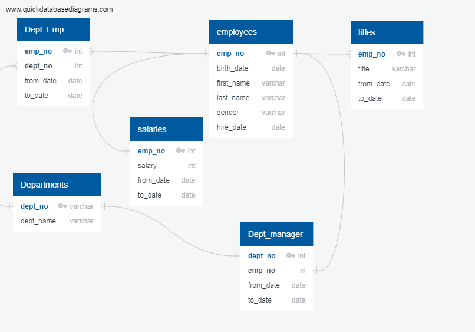

# **Pewlett-Hackard-Analysis**

## **1. Background and objectives:**
The CEO of Pewlett-Hackard has determined that **anyone born between 1952 and 1955 and also hired between 1985 and 1988 will begin to retire.
In order to future-proof the company needs to determine how many people will be retiring.**

Instead of having a large chunk of their workforce retiring, they want to introduce a mentoring program: experienced and successful employees stepping back into a part-time role instead of retiring completely. Their new role in the company would be as a mentor to the newly hired folks.

In this analysis I determined the total number of employees per title who will be retiring, and from that list, identify those employees who are eligible to participate in a mentorship program.

Using information organized in data tables on employees I constructed a database using PostgreSQL and performed queries using filters, joins, and functions to accomplish these tasks.

## **2. Procedure:**

### **a. Data**
The raw data I used is contained in the following tables:

- departments.csv

- dept_emp.csv

- dept_manager.csv

- employees.csv

- salaries.csv

- titles.csv

### **b. ERD**

I used Quick DBD through quickdatabasediagrams.com to create the entity relationship diagram (ERD) of the database (conceptual, logical, and physical diagram of the database).

### **c. Database and queries**

Following the ERD I created the database in Postgres. The tables and queries were created in SQL. As mentioned in the beginning, the CEO's definition for retiring employees is: **anyone born between 1952 and 1955 and also hired between 1985 and 1988 will begin to retire.**

The summary of the steps are as follows:

- Raw data was included in the database as SQL tables.
- Queries were carried out to obtain two result tables:

    - Table 1: Number of Retiring Employees by Title._ 
        This is a table that shows how many vacancies PH can expect for each job title. The steps are:
        1. Join the employees, titles, salaries, and department employees tables, by employee number, filtering the table by:
        
            WHERE (e.birth_date BETWEEN '1952-01-01' AND '1955-12-31')

            AND (e.hire_date BETWEEN '1985-01-01' AND '1988-12-31')

        2. Selecting the desired records from the list by partitioning the data by employee number, and choosing the employee record with the latest starting date with the following line:

            PARTITION BY (emp_no) ORDER BY from_date DESC

    - Table 2: Mentorship Eligibility._ This table lists those employees from Table 1 who are eligible to participate in the mentorship program. To be eligible, the employees who are retiring will need to have a date of birth that falls between January 1, 1965 and December 31, 1965. The steps are:

        1. Join Table 1 with employees and titles tables, by employee number, filtering the table by:

            WHERE (e.birth_date BETWEEN '1965-01-01' AND '1965-12-31')

        2. Selecting the desired records from the list by partitioning the data by employee number and choosing the employee record with date 1/1/9999 (present) with the following line:

            PARTITION BY (emp_no) ORDER BY to_date DESC

### **Challenges**

    The employees.csv table is missing employee numbers that are referenced in the other tables. This difference had to be reconciled by eliminating the employee records missing in the table employees.csv from all the other tables that contained the column "emp_no".

## **3. Results:**

**3.1 ERD**

The following image shows the ERD produced in quickdatabasediagrams.com using the raw data tables.

**3.2 Number of Retiring Employees by Title**

The resulting table is the file "challenge_d1_retiring_emp_by_title.csv". This table contains records of 26,748 employees who will retire according to the definition or a retiring employee given by the CEO. The table contains the employee number, first and last name, title, and the starting date of the employee performing as such.

**3.3 Mentorship Eligibility**

The resulting table is the file "challenge_d2_1965_mentorship_program.csv". This table is empty because there is no retiring employee eligible for the mentorship program. The reason is that given that the requisite to be eligible is to be a retiring employee born in 1965, and according to the definition of retiring employees, they have a birth date between the years 1952 and 1955.

**Recommendation:**

As an extra recommended result, I produced another table where the requisite to be eligible is to be a retiring employee born in 1955 ("challenge_d2_1955_mentorship_program.csv").

As a result, the query gave a list of 6,866 employees who are eligible for the mentorship program, if the requisite to apply is to be born in the year 1955.

